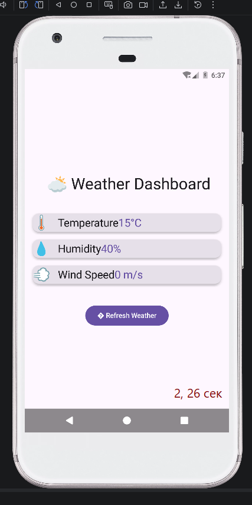

# Лабораторная работа №17-18. Корутины на практике: Метеосводка

## Краткое описание

В ходе лабораторной работы было реализовано приложение по метеосводке. При запуске приложения отображается температура, влажность и скорость ветра. Также есть возможность обновления погоды.

## Функциональность приложения

1. Отображение температуры
2. Автообновление приложения каждые 10 секунд, и данные загружаются заново
3. Реализована кнопка выхода из приложения
4. Кнопка симуляции ошибки
5. Отображение влажности и скорости ветра

Шаг 7: время от нажатия до полной загрузки 4, 92

Шаг 9: 2.26

## Технологии и библиотеки

+ Корутины (Dispatchers.Main)
+ async / await (запуск и результат корутины)
+ Архитектура: MVVM (viewModel)
+ Библиотеки: `lifecycle-viewmodel-compose`, `kotlinx-coroutines-android`, `kotlinx-coroutines-core`

## Контрольные вопросы

1. `launch` Отправка логов, сохранение данных в БД, обновление UI (когда не важно, что вернется). `async` Параллельные запросы к API (нужны данные), вычисления, результат которых отображается на экране.
```kotlin
// launch
viewModelScope.launch {
    saveDataToDatabase() // Ничего не возвращает
}

// async
val result = viewModelScope.async {
    fetchUserData() // Возвращает User
}.await()
```

2. suspend — это функция, которая может приостановить свое выполнение на некоторое время, не блокируя поток, в котором она работает.delay() — это suspend-функция. Она просто приостанавливает текущую корутину, позволяя потоку заниматься другими задачами

3. Диспетчеры определяют, в каком потоке (или пуле потоков) будет выполняться корутина.
Dispatchers.Main изменяет текст, отображает SnackBar. Dispatchers.IO загрузка картинки из интернета, чтение файла. Dispatchers.Default - сортировка большого списка

|Диспетчер|Когда использовать|Пример задачи|
|---|---|---|
|Dispatchers.Main|Работа с UI|Изменение текста в TextField, отображение Snackbar|
|Dispatchers.IO|Сеть, диск, БД|загрузка картинки из интернета|
|Dispatchers.Default|CPU-интенсивные задачи|сортировка большого списка|

При выполнении тяжелого вычисления UI приложения зависнет.

4. Если не обработать исключение в корутине, оно распространится вверх по иерархии. В случае использования viewModelScope это приведет к крашу (crash) приложения, так как необработанное исключение достигнет корневого обработчика потока.
Для корректной обработки ошибок используют конструкцию try-catch.
try-catch внутри launch используется для обработки исключений, которые могут возникнуть при выполнении корутины.

5. viewModelScope - строенная в ViewModel область видимости для корутин. Все корутины, запущенные внутри viewModelScope, автоматически отменяются, когда ViewModel становится "очищенной"

## Как запустить проект

1. Клонируйте ссылку на репозиторий `git clone url репозитория`
2. Синхронизация проекта
3. Запуск приложения (Run)

## Скриншоты



**Автор:** Заставная Наталия
**Группа:** ИСП-231
**Дата выполнения:** 19.04.2026
